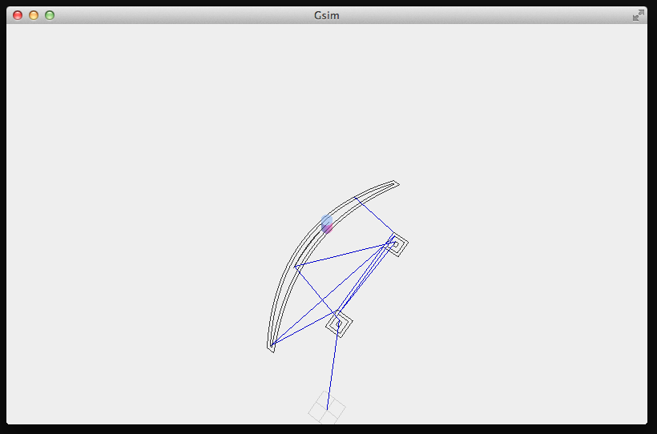

# Gsim

Cross-platform command-line gcode simulator.

```
cat smile.gcode | gsim
```




## Installation
```
npm install -g gsim
```

## Meta Comments

Gsim can be annotated with addition information about the job with meta attribute comments. 
The format is simply `(key=value key2=value2)`.

```
(tooldiameter=0.5)
G0 X1
G0 Y1
...
```

My hope is that other generators and simulators will adopt this convention and collaborate towards a standard.

Currently `tooldiameter` is the only attribute.
